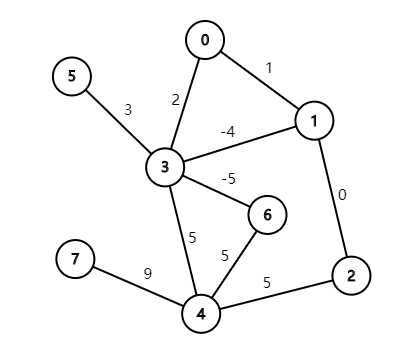
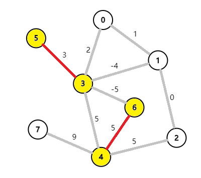
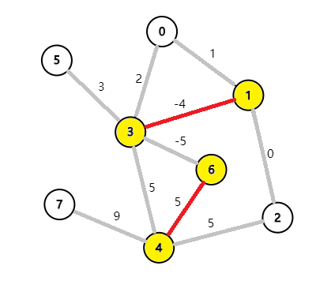
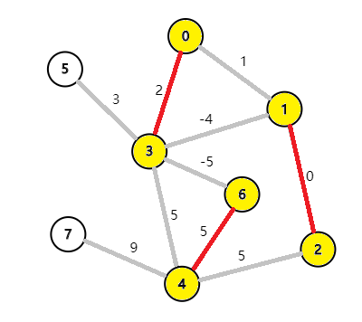
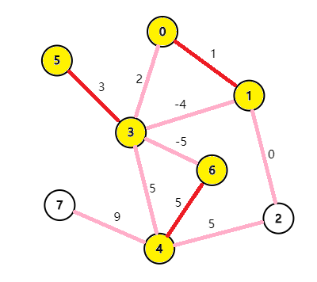

# 图的匹配问题详解

（包括：带花树算法 & Tutte矩阵）

By zjrzzzjr（或：jerryzheng2005/zhengjiarui/zghtyarecrenj），**转载务必注明出处**

## 图的匹配的基本概念

下面（图1）是一张无向图 $G = \left\{ V, E \right\}$（不一定是二分图）。

**匹配是一个边的集合**。图中的两个点如果以边相连就可以形成匹配，但是**一个点只能连一条在匹配中的边。**

一张图中的匹配边的总数称为 **Cardinality**。

下面（图2）是合法的匹配，$\text{Cardinality}=2$

但是如果把边 $(0,3)$ 加入匹配，那么它就是非法的匹配，因为有 $2$ 条匹配边的端点都是 $3$。

我们称在匹配中的边为**匹配边**，不在匹配中的边为**未匹配边**。**匹配点与非匹配点**的定义相同。

**极大匹配（Maximal Matching）**是指在当前已完成的匹配下,无法再通过增加未完成匹配的边的方式来增加匹配的边数。如下图（图3），$\text{Cardinality}=2$

**最大匹配（Maximum Matching）**是所有极大匹配当中边数最大的一个匹配，我们称之为 $M$。选择这样的边数最大的子集称为图的最大匹配问题。如下图（图4），$\text{Cardinality}=3$

**完美匹配（Perfect Matching）**一个图中所有的顶点都是匹配点的匹配，即 $2|M| = |V|$。完美匹配一定是最大匹配，但并非每个图都存在完美匹配。

当图带权的时候，**匹配的权**为所有匹配边的权值之和。图1的匹配的权为 $8$。

**最大权匹配（Maximum Weight Matching）**是一张图中权值最大的匹配。如下图（图5），匹配的权为 $9$。

**maximum weight maximum cardinality matching** 是一张图配对数最多的前提之下权值最大的匹配。

## 二分图匹配

有两种算法：一是匈牙利算法，二是使用网络流算法。具体的我不细讲了，毕竟本文重点是带花树。

网络流算法的实际时间复杂度在这个paper（[Efficient Algorithms for Finding Maximum Matching in Graphs](https://zjrzzzjr.github.io/blossom%20tree/p23-galil.pdf)）中提到了，其实是 $O(m\sqrt n)$。这可以解释为什么有些题目匈牙利会T飞。

不会的自己去各种博客自学一下吧。以后可能我也会写的

## 带花树算法

这个算法的名字非常有意思啊……

