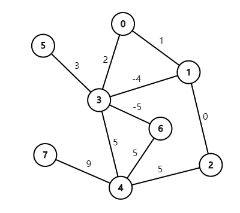
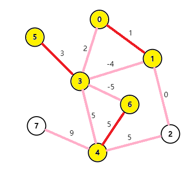

# 图的匹配问题详解

（包括：带花树算法 & Tutte矩阵）

By zjrzzzjr（或：jerryzheng2005/zhengjiarui/zghtyarecrenj），**转载务必注明出处**

## 前置芝士

二分图匹配算法-匈牙利算法 & 网络流求匹配

## 图的匹配的基本概念

下面（图1）是一张无向图 $G = \left\{ V, E \right\}$（不一定是二分图）。



**匹配是一个边的集合**。图中的两个点如果以边相连就可以形成匹配，但是**一个点只能连一条在匹配中的边。**

一张图中的匹配边的总数称为 **Cardinality**。

下面（图2）是合法的匹配，$\text{Cardinality}=2$


但是如果把边 $(0,3)$ 加入匹配，那么它就是非法的匹配，因为有 $2$ 条匹配边的端点都是 $3$。

我们称在匹配中的边为**匹配边**，不在匹配中的边为**未匹配边**。**匹配点与非匹配点**的定义相同。

**极大匹配（Maximal Matching）**是指在当前已完成的匹配下,无法再通过增加未完成匹配的边的方式来增加匹配的边数。如下图（图3），$\text{Cardinality}=2$


**最大匹配（Maximum Matching）**是所有极大匹配当中边数最大的一个匹配，我们称之为 $M$。选择这样的边数最大的子集称为图的最大匹配问题。如下图（图4），$\text{Cardinality}=3$


**完美匹配（Perfect Matching）**一个图中所有的顶点都是匹配点的匹配，即 $2|M| = |V|$。完美匹配一定是最大匹配，但并非每个图都存在完美匹配。

当图带权的时候，**匹配的权**为所有匹配边的权值之和。图1的匹配的权为 $8$。

**最大权匹配（Maximum Weight Matching）**是一张图中权值最大的匹配。如下图（图5），匹配的权为 $9$。



**maximum weight maximum cardinality matching** 是一张图配对数最多的前提之下权值最大的匹配。

## 二分图匹配

有两种算法：一是匈牙利算法，二是使用网络流算法。具体的我不细讲了，毕竟本文重点是带花树。

网络流算法的实际时间复杂度在这个paper（[Efficient Algorithms for Finding Maximum Matching in Graphs](https://zjrzzzjr.github.io/blossom/p23-galil.pdf)）中提到了，其实是 $O(m\sqrt n)$。这可以解释为什么有些题目匈牙利会T飞。

不会的自己去各种博客自学一下吧。以后可能我也会写的

## 带花树算法·一般图最大匹配

### 先来思想

解决一般图匹配问题。

匹配问题总归要找增广路的，这一点毋庸置疑。

然后我们考虑一个问题：如果在某一轮中有一个点不出现在任何一条增广路径上，那么它就是像我这样的废柴。（因为如果它没有被找到，那么就一定没有贡献了）。所以每个点至多走一遍。HOWEVER，这个美妙的性质对于一般图不一定成立。我们发现讨厌的是图中的奇环，如果没有奇环那么我们就可以愉快地跑匈牙利了。

> **[THEORY i]** 通过观察&手玩数据，我们发现如果一个奇环上的一个点在一条增广路径上，那么整个奇环的点都可以成为某一条增广路上的点。
>
> **[DERIVATION]** 显然

为了方便理解，来一个图（图中 1-3-5-4-2 为一个奇环）。


然后我们可以想到缩点，把奇环缩成一个点（这个点叫花，就是带花树的花）。

我们计一个花中的顶点为花上深度最小的节点（我取的名字，你可以把它理解为这个花缩成的点）。把原来连到花上其他点的边改到顶点上就是缩点操作。

令缩完点的图为 $G'$。那么原图的最大匹配就是 $G'$ 中的最大匹配加上奇环内的匹配（除了花顶点外两两匹配就是最大匹配，因为它是一个奇环）。

#### 可爱的THEORY

> **[THEORY ii]** 显然，$G'$ 中的增广路一定是 $G$ 中的增广路。
>
> **[FAQ]** 一点也不显然。
>
> 好，上证明。

#### 可爱的DERIVATION

首先，如果 $G'$ 的增广路径不经过花，那么显然是 $G$ 中的增广路径！

1. 如果 $G$ 中的这条增广路径为 $x \rightarrow \cdots \rightarrow y \rightarrow \cdots \rightarrow z \rightarrow \cdots$，$y$ 和 $z$ 在一朵花上面，那么 $G'$ 中的增广路径就是把 $y \rightarrow \cdots \rightarrow z$ 缩成了一点——带花树的顶点。

   证明一下为什么是这样的：因为所有原来花上面的边都连到了顶点上，则根据 **[THEORY i]**，如果有增广路经过 $y$，那么整个花上的点一定都可以在增广路上面。而这样所有花上的点都是匹配点，所以 $z$ 出发的边是非匹配边。

2. 对于 $G'$ 中的增广路，如果这条增广路径为 $x \rightarrow \cdots \rightarrow y \rightarrow z \rightarrow \cdots$，$y$ 是一朵花的顶点，$z$ 不在花上，那么我们就可以把 $y \rightarrow z$ 的边拆成先从 $y$ 通过花上的路径走到一个有到 $z$ 的边的点，再通过那条边到 $z$。

证毕！

### 再思考实现

先来看一个故事：

> zjr 在一次模拟赛中因为用tarjan缩点对于重新建图的时候点编号的处理不到位，他光荣地成为了这道题爆零的人们中的一个（而且我还因为重新存图MLE了！我菜QaQ）

这则故事给你什么启示？我们不能重新建图。

我想到了一个绝妙的主意，可惜太小，写不下。然后我看到rqy的博客里面有一个绝妙的式子：

$f$ 是一个类似并查集的数组。对于一朵花上的点 $x$，$f(x) =$ 顶点。对于一个不在花上的点 $x$，$f(x) = x$。

这样就可以巧妙的避免重新建图了。

在此感谢rqy。（资瓷 [rqy博客](rqy.moe)！）

因为有可能花套花套花套花套花套花套花套花套花套花套花套花套花套花套花$\cdots$（套娃使人快乐），所以我们要用并查集维护 $f$ 数组。

我们考虑到每次去找节点的奇偶性很麻烦，所以我们直接维护每个点要往哪边走，你可以用AC自动机中的fail指针来类比。

注意：已经在一朵花里的两个点不能缩。

时间复杂度多少？每次处理的时候的复杂度为 $O(n^2)$，共处理 $n$ 次，所以总复杂度为 $O(n^3)$。

### 最后欣赏代码

模板题：[UOJ79](http://uoj.ac/problem/79)。

```cpp
const int N = 505;

int n, m, head[N], to[N * N], nxt[N * N], tot, f[N];
int post[N], S[N], Q[N], Top, pre[N], vis[N], cnt;

inline int find(int x) {
	while (x != f[x]) x = f[x] = f[f[x]];
	return x;
}

inline int lca(int x, int y) {
	++cnt;
	int xx = find(x), yy = find(y);
	while (1) {
		if (x) {
			if (vis[x] == cnt) return x;
			vis[x] = cnt;
			x = find(pre[post[x]]);
		}
		x ^= y ^= x ^= y;
	}
}

IL void blossom(int x, int y, int l) {
	while (find(x) != l) {
		pre[x] = y;
		if (S[post[x]] == 1) Q[Top++] = post[x], S[post[x]] = 0;
		if (f[x] == x) f[x] = l;
		if (f[post[x]] == post[x]) f[post[x]] = l;
		y = post[x], x = pre[y];
	}
}

inline int Match(int x) {
	for (int i = 1; i <= n; ++i) 
		f[i] = i;
	memset(S, 0xff, sizeof(S));
	Top = 1, Q[0] = x, S[x] = 0;
	for (int i = 0; i < Top; ++i) {
		for(int T = head[Q[i]]; T; T = nxt[T]) {
			int y = to[T];
			if (S[y] == -1) {
				pre[y] = Q[i]; S[y] = 1;
				if(!post[y]) {
					for(int u = y, v = Q[i], lst; v; u = lst, v = pre[u])
						lst = post[v], post[v] = u, post[u] = v;
					return 1;
				}
				Q[Top++] = post[y], S[post[y]] = 0;
			}
			else if (!S[y] && find(y) != find(Q[i])) {
				int l = lca(y, Q[i]);
				blossom(y, Q[i], l);
				blossom(Q[i], y, l);
			}
		}
	}
	return 0;
}

inline void addedge(int x, int y) {
	nxt[++tot] = head[x], head[x] = tot, to[tot] = y;
}

int main() {
	read(n), read(m);
	for (int i = 1; i <= m; ++i) {
		int x, y;
		read(x), read(y);
		addedge(x, y), addedge(y, x);
	}
	int ans = 0;
	for (int i = n; i; --i) 
		if (!post[i]) ans += Match(i);
	write(ans), putchar('\n');
	for (int i = 1; i <= n; ++i) 
		write(post[i]), putchar(' '); 
	putchar('\n');
	return 0;
}
```

